# Taller "Herramientas para colaborar en el blog de QGIS España"

## Agenda

1. Bienvenida y presentaciones
2. [Objetivos del Taller](#objetivos)
3. ¿Cómo contribuir a un proyecto de código abierto?
4. Página web de la Asociación QGIS España
5. Uso de Markdown
6. Forma 1. Crear un artículo desde GitHub (Práctica 1)
7. Forma 2. Trabajando desde repositorio local (Práctica 2)

## Objetivos del Taller []<a name="objetivos"></a>

- Contribuir a un proyecto de código abierto usando como ejemplo la web de la [Asociación QGIS España](https://www.qgis.es/)
- Estructura de la web de la [Asociación QGIS España](https://www.qgis.es/)
- Generar los archivos necesarios para añadir una entrada al blog de la página.
- **Git** (configuración, ramas, commit...)
- **GitHub** y pull request
- Lenguaje de marcado **Markdown**

## ¿Cómo contribuir a un proyecto de código abierto?

Un proyecto abierto no es solo código...(C++, Python, Plugins). El mismo QGIS tiene una página que la que se indica cómo poder contribuir [https://qgis.org/es/site/getinvolved/index.html](https://qgis.org/es/site/getinvolved/index.html)

- Crear documentación
- Realizar/mejorar
- Información de errores
- Testeando versiones
- Respondiendo dudas
- Aportando económicamente
  
## Página web de la Asociación QGIS España

La url pública de la página es [https://www.qgis.es/](https://www.qgis.es/)

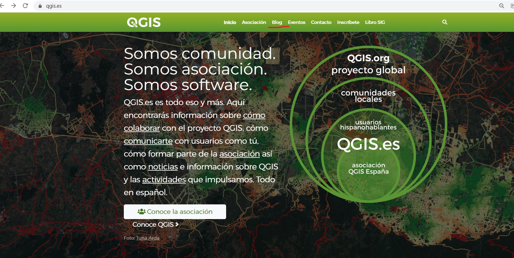

En ella tenemos un apartado de blog, por ejemplo [https://www.qgis.es/post/2021-12-15-qgis-no-esta-afectado-por-log4j/](https://www.qgis.es/post/2021-12-15-qgis-no-esta-afectado-por-log4j/)

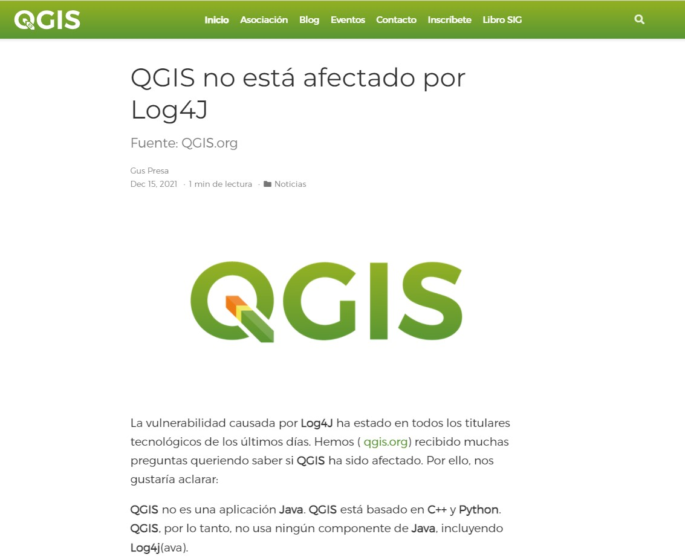

El código de la página web está se encuentra en **GitHub**, que de forma sencilla es una página que aloja proyectos de código principalmente y que usa control de versiones en ese caso **Git**.

[https://github.com/qgises/qgis-es](https://github.com/qgises/qgis-es)

GitHub es plataforma web basado en el control de versiones donde poder alojar nuestros proyectos de código para compartirlos con la comunidad, colaboradores o cualquier persona que esté interesada. A pesar de ser la más conocida, no es la única opción. Tenemos también GitLab o Bitbucket. a Asociación cuenta también con un repositorio en GitLab [https://gitlab.com/qgis_es](https://gitlab.com/qgis_es)

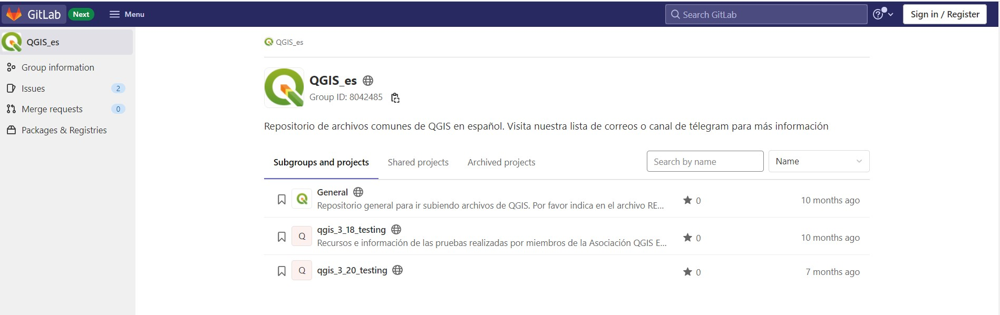

### ¿Dónde añadir nuestros artículos?

Dentro del repositorio de la web en GitHub...

- **Entradas**. 
  - Ubicadas en  [/content/post](https://github.com/qgises/qgis-es/tree/master/content/post)
  - Carpeta debe tener como prefijo la fecha en formato (2022-01-21) más el nombre que queremos que aparezca en la URL. **No debemos añadir espacios para separar palabras. Usamos guiones**
  - Artículo en archivo *index.md*
  - Todas las imágenes que queramos añadir. Ojo a la resolución.

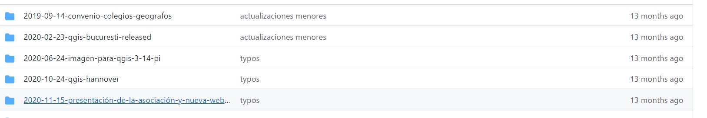

- **Ficha de Autores**
  - Ubicadas en [/content/authors](https://github.com/qgises/qgis-es/tree/master/content/authors)
  - Carpeta con el nombre del autor ej. patricio-soriano. **No debemos añadir espacios para separar palabras. Usamos guiones**
  - Archivo *_index.md*
  - Foto *avatar*

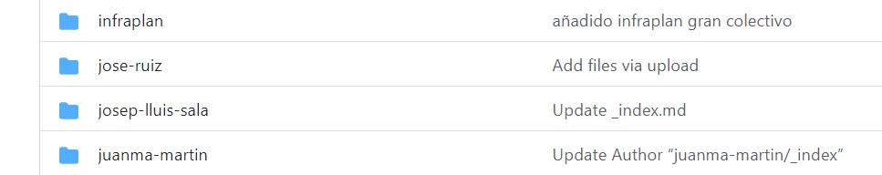

Para añadir el artículo en el blog o crear nuestra ficha por primera vez lo mejor copiar una carpeta existente, añadir el texto del blog con Markdown y modificar los parámetros.

## Uso de Markdown

Markdown es un lenguaje de marcado que facilita la aplicación de formato (negrita, enlaces, encabezados, listas...) a un texto empleando una serie de caracteres de una forma especial. 

Como explica John Gruber uno de sus creadores, *Markdown es realmente dos cosas: por un lado, el lenguaje; por otro, una herramienta de software que convierte el lenguaje en HTML válido*. 

Un buen enlace sobre [Qué es Markdown, para qué sirve y cómo usarlo](https://www.genbeta.com/guia-de-inicio/que-es-markdown-para-que-sirve-y-como-usarlo)

En [Markdown Cheat Sheet](https://www.markdownguide.org/cheat-sheet/) tenemos una guía de las marcas que se usan en Markdown.

Vemos un ejemplo en el blog:

- [Entrada en la web](https://www.qgis.es/post/2021-03-29-qgis-docker/)
- [Post en MarkDown](https://github.com/qgises/qgis-es/tree/master/content/post/2021-03-29-qgis-docker)


## Forma 1. Crear un artículo desde GitHub

1. Lo primero que debemos hacer es realizar un **fork** (bifurcación) del repositorio de la web en nuestra cuenta de GitHub. Esto nos va a permitir modificar, romper, toquetear un repositorio sin que el original se vea afectado.

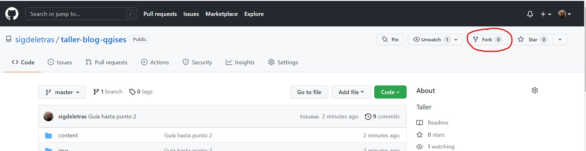

2. Creamos una copia del proyecto general en nuestra cuenta de GitHub. A partir de ese momento podemos trabajar con el código sin que el proyecto original se vea afectado

3. Ya en nuestra cuenta de GitHub podríamos crear los archivos y estructuras necesarias para añadir una entrada al blog.

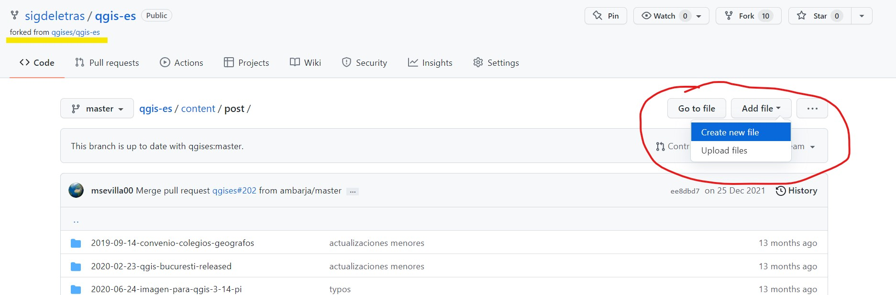

4. Cada vez que se añadan o modifiquen ficheros debemos realizar una confirmación (commit). Cada commit va acompañador de una descripción del trabajo que hemos hecho.

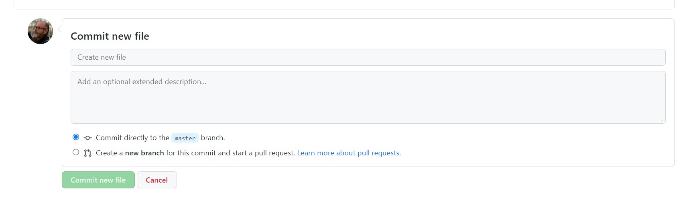

Gracias a Git, podemos acceder al historial de cambios y si fuera necesario revertirlo.

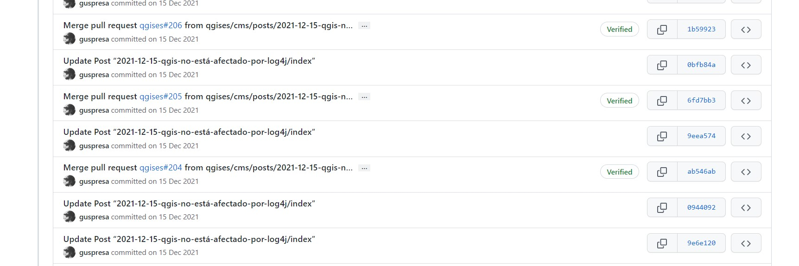

5. El último paso es realizar un *Pull Request* (una petición de cambio) al repositorio original para que los 'propietarios' analicen los cambios y mejoras propuestas y lo incluyan en el proyecto (la web de la Asociación).

Es importante comentar el objetivo del PR, no lo que se ha hecho ya que para esto están los commits.

Siempre que vayamos a realizar un nuevo aporte debemos actualizar el repositorio de nuestra cuenta en relación con el original.

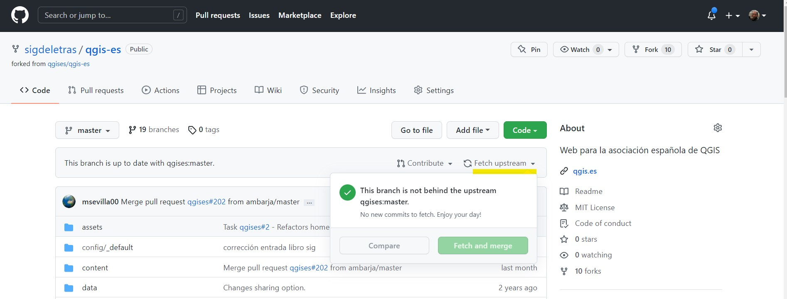

Artículo recomendado [Cómo hacer tu primer pull request en GitHub](https://www.freecodecamp.org/espanol/news/como-hacer-tu-primer-pull-request-en-github/)
Vamos a usar el este repositorio para reproducir el flujo que debemos hacer

## Práctica 1. Crear ficha de autor en repositorio de prueba desde GitHub

[https://github.com/sigdeletras2/repotaller](https://github.com/sigdeletras2/repotaller)

1. Accedemos a la carpeta [/authors](https://github.com/sigdeletras2/repotaller/tree/main/content/authors)
2. Abrimos la carpeta *patricio-soriano* y copiamos el código del archivo _index.md (Copy raw contents)

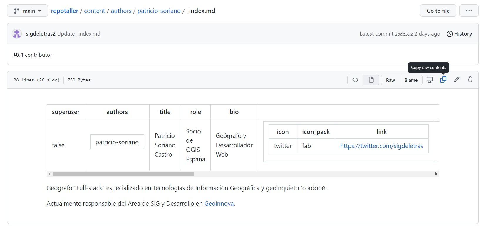

3. Nos situamos en /authors y creamos un archivo (_index.md) y una carpeta con nuestro nombre.
4. Pegamos el contenido y editamos la información con nuestros datos.
5. Describimos los cambios hechos
6. Confirmamos

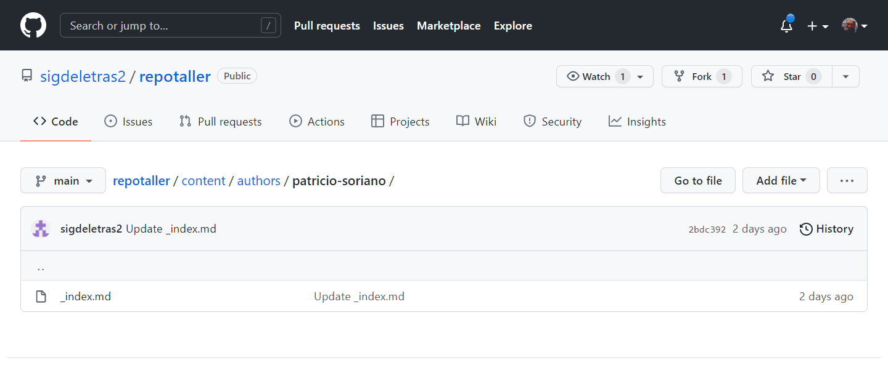

7. Hacemos un PR.

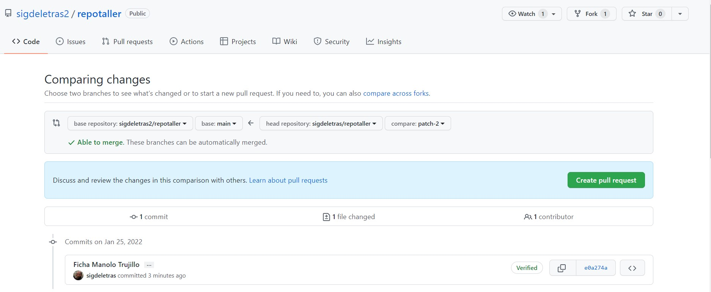

## Forma 2. Trabajando desde repositorio local

Es la forma más habitual. Usaremos toda la potencia de Git mediante comandos en terminal. Pero será interesante en apoyarnos en editores de código como VSCode.

0. Si es un fork, revisar que esté actualizado (fetch)
1. Clonar el repositorio remoto a nuestro equipo (clone). Si ya tenemos clonado el repositorio, bajaremos los cambios recientes (pull)
2. Creamos una rama (branch) para el trabajo/modificación/nuevo desarrollo/corrección
3. Añadimos y confirmamos (add/commit)
4. Subimos los datos al repositorio remoto (push)
5. Ya en GitHub hacemos el PR.
6. Limpiamos las ramas

### Configuración de Git

Antes de usar Git por primera vez hay que configurarlo con nuestros datos. Será la información que se vincule a los commits que hagamos. Esto es fundamental si se trabaja en equipos.

```
$ git config --global user.name "John Doe"
$ git config --global user.email johndoe@example.com
```
### 0. Hacer un fork desde GiHub

Usaremos un repositorio de pruebas.
[https://github.com/sigdeletras2/repotalle](https://github.com/sigdeletras2/repotaller)

### 1. Clonar el repositorio en nuestro equipo local. 

Hay varias opciones

  - Descarga el zip
  
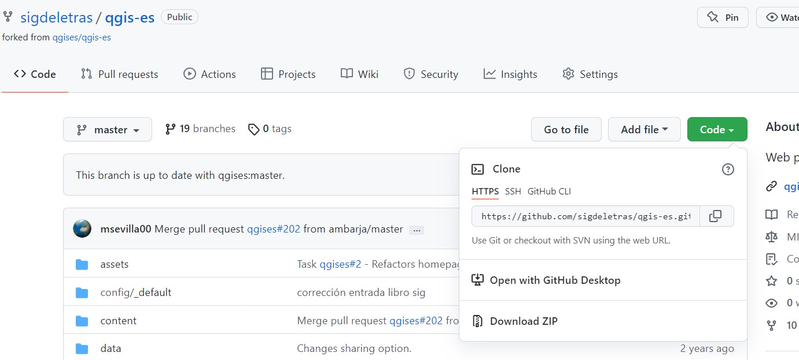

  - Hacer un git clone usando terminal

```
git clone https://github.com/sigdeletras/taller-blog-qgises.git
```

  - GitHub Desktop

### 2. Crear una rama (branch)

Abrimos la carpeta en VSCode.

Es una buena práctica crear una rama (branch) nueva cuando trabajas con repositorios. El nombre de la rama debe ser breve y debe reflejar el trabajo que estamos haciendo.

Usamos git checkout o lo hacemos desde VSCode.

Desde un terminal de VSCode

```
git checkout -b articulo_tunombre
```

### 3. Añadir nuestros archivos e ir confirmando los cambios (commit)


Estados y flujo de Git

Cuando queramos hacer un registro de nuestros cambios haremos un *commit* donde comentaremos brevemente los trabajos y cambios realizados. Esto es la clave de los sistemas de control de versiones.

```
git status
git add
git commit -m 'Añadida ficha de autor'
```

Algunos complementos Git para VSCode

- 👌[GitLens](https://marketplace.visualstudio.com/items?itemName=eamodio.gitlens) Paneles sobre commits, ramas, historial de ficheros...
- [Git History](https://marketplace.visualstudio.com/items?itemName=mhutchie.git-graph) Gráfico del historial
- Git Graph
  
### 5. Envía los cambios a GitHub

Subir los cambios a GitHub

```
git push origin [Nombre de la Rama]

```

### 6. Crea un pull request

- Ve a **tu repositorio en GitHub** hacer clic en "Pull request"
- Es interesante hacer un resumen de los trabajos que tiene el PR para que el 'dueño' del repositorio original sepa que trabajos se han realizado, pueda valorarlos y si lo cree oportuno añadirlos, aceptado el PR.
- El 'propietario' del repositorio puede aceptar el PR o sugerir cambios o mejoras antes de unirlo con su rama original

### 7. Unir/Limpiar ramas

Es una buena práctica limpiar ramas que ya han sido 'mergeadas'

```
git checkout master
git merge nombre-de-la-rama
git push
git branch -d nombre-de-la-rama
```

### 8. Sincroniza tu rama maestra con la del repositorio original

Antes de enviar cualquier pull request al repositorio original debes sincronizar tu repositorio con aquel.

Incluso si no vas a enviar un pull request al repositorio original, es mejor efectuar la sincronización, ya que pueden haberse agregado algunas prestaciones o funciones adicionales y haberse corregido algunos errores desde la vez que realizaste un fork de aquel repositorio.

https://docs.github.com/es/pull-requests/collaborating-with-pull-requests/working-with-forks/syncing-a-fork

## Práctica 2. Crear un artículo desde local, subirlo a remoto y hacer un PR.
